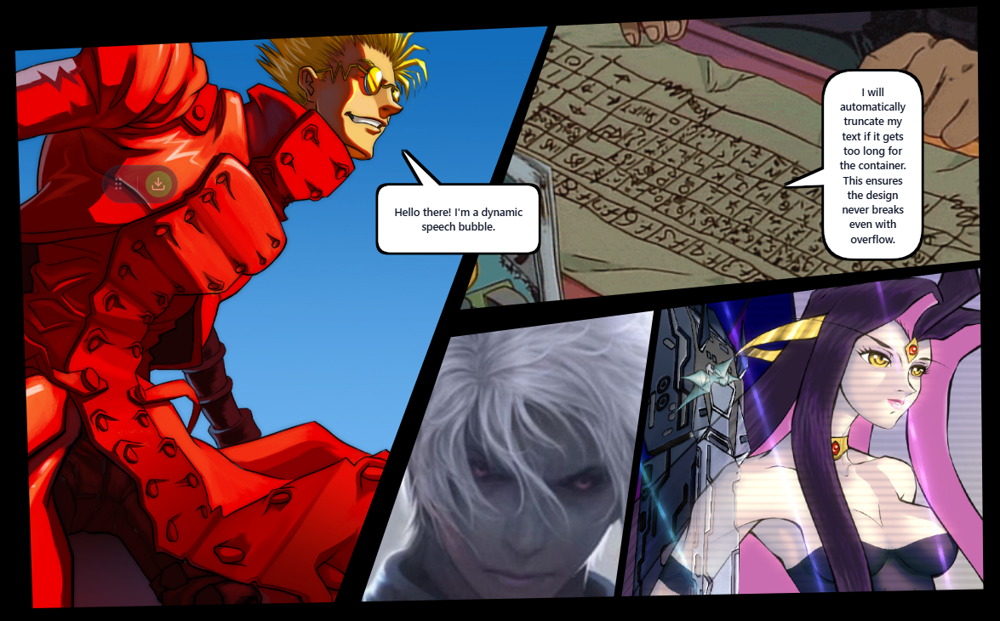

https://github.com/user-attachments/assets/04d92909-6f3d-4d92-87ad-6fe0205eed45




# manga-comic-speech-bubbles-layout-strip-panel

<!-- ZS:COMPLEXITY:HIGH -->
<!-- ZS:PLATFORM:WEB -->
<!-- ZS:LANGUAGE:TYPESCRIPT -->
<!-- ZS:FRAMEWORK:REACT -->
<!-- ZS:STYLING:TAILWIND -->

## Description

manga-comic-speech-bubbles-layout-strip-panel is a specialized web-based graphics editor designed for creating manga and comic book layouts. It focuses on the procedural generation of speech bubbles, dynamic panel framing, and "slash" effects (cuts). 

Unlike generic vector editors, manga-comic-speech-bubbles-layout-strip-panel utilizes geometric algorithms to automatically handle complex tasks such as speech bubble tail positioning and image masking based on slash lines. It provides a highly interactive canvas where users can manipulate control points to resize, reshape, and style comic elements in real-time, exporting the final result as a clean SVG.

## Functionality

### Core Features

1.  **Dynamic Speech Bubbles**:
    *   Create text containers with rounded corners.
    *   Automatic tail generation that connects to the bubble body based on the position of an external anchor point.
    *   Text auto-centering and wrapping.
2.  **Slash Cuts (Effect Lines)**:
    *   Create linear "cuts" that simulate sword slashes or panel dividers.
    *   Variable thickness at the start and end points (tapering effect).
3.  **Panel Frames**:
    *   Create polygonal frames (walls) to define comic panels.
    *   Adjustable vertex positions and color.
4.  **Image Composition**:
    *   Import images via drag-and-drop.
    *   **Destructive Masking**: Images can be "locked" to specific Cuts. When locked, the application calculates a mask based on the Cut line, hiding the portion of the image on one side of the line (simulating an image being sliced).
5.  **Export**:
    *   Generate and download a standard SVG file containing all elements.

### User Interface

The application should use a dark-themed, full-screen canvas approach.

#### Layout Layers
1.  **Canvas Layer (Bottom)**: An SVG surface rendering images, cuts, frames, and bubbles.
2.  **Overlay Layer (Middle)**: HTML/DOM elements for text editing and context menus.
3.  **Interaction Layer (Top)**: SVG handles for dragging and resizing.

#### The Toolbar
A floating, draggable toolbar containing:
*   **Grip**: For moving the toolbar.
*   **Add Bubble**: Inserts a default speech bubble.
*   **Add Cut**: Inserts a diagonal slash line.
*   **Add Frame**: Inserts a rectangular panel frame.
*   **Add Image**: Inserts an image placeholder.
*   **Download**: Triggers the SVG export.
*   **Mode Toggle**: Switches between "Edit Mode" (shows handles) and "Preview Mode" (hides handles/grids).

#### Interactive Handles
Every element must have specific visual handles for manipulation:
*   **Bubbles**:
    *   *Body*: Drag to move the whole bubble.
    *   *Anchor*: A circular handle to position the tail tip.
    *   *Radius*: A handle on the border to adjust corner roundness.
    *   *Resize*: A handle at the bottom-right to adjust width/height.
*   **Cuts**:
    *   *Endpoints*: Handles to move the start and end of the line.
    *   *Thickness Controls*: Floating UI near endpoints to increase/decrease thickness (`+` / `-` buttons).
*   **Frames**:
    *   *Corners*: 4 handles to move each corner independently.
    *   *Color Picker*: A floating control to change the fill color.
*   **Images**:
    *   *Resize*: Bottom-right handle.
    *   *Scale*: Top-right handle to zoom the image within its container.
    *   *Lock/Unlock*: A toggle button to calculate/clear masks against intersecting Cuts.

### Behavior Specifications

*   **Tail Logic**: The speech bubble tail should not be a simple triangle. It must calculate the intersection between the bubble center and the anchor point to determine which side of the rectangle the tail should emerge from. The tail base should slide along the edge of the bubble, clamped by the corner radius.
*   **Masking Logic**: When an image is "Locked", the system must identify all *Cut* objects that physically intersect the image's bounding box. For every intersecting cut, a geometric mask is generated that hides the half-plane opposite to the image's center.
*   **Exporting**: The export must embed the text inside a `foreignObject` tag within the SVG to preserve layout, or convert strictly to SVG paths. The download triggers a blob download of `manga-comic-speech-bubbles-layout-strip-panel-export.svg`.

## Technical Implementation

### Architecture

The application is a Single Page Application (SPA) using React and TypeScript. It uses a centralized state management approach (React `useState`) to hold arrays of data objects.

The rendering engine is primarily SVG-based. React components are used to render the SVG paths based on the state data.

### Data Structures

The state should be managed using the following interfaces:

```typescript
interface Point { x: number; y: number; }

interface BubbleData {
  id: string;
  x: number; y: number;     // Position
  width: number; height: number;
  anchor: Point;            // Tail tip position
  text: string;
  borderRadius: number;
}

interface CutData {
  id: string;
  p1: Point; p2: Point;     // Start and End coordinates
  t1: number; t2: number;   // Thickness at start and end
}

interface FrameData {
  id: string;
  p1: Point; p2: Point; p3: Point; p4: Point; // 4 arbitrary corners
  color: string;
}

interface ImageData {
  id: string;
  src: string | null;       // Base64 image data
  scale: number;
  isLocked: boolean;
  lockedCutIds: string[];   // IDs of cuts currently masking this image
}
```

### Algorithms

#### 1. Bubble Path Generation
The application must implement a function that generates an SVG path string (`d` attribute) for the bubble.
*   **Inputs**: x, y, width, height, anchor point, radius.
*   **Process**:
    1.  Determine the vector from the rectangle center to the anchor point.
    2.  Calculate the intersection of this vector with the rectangle's bounding box to find the "active side" (Top, Right, Bottom, or Left).
    3.  Draw a rounded rectangle path.
    4.  Inject three additional points into the path on the "active side" to form the tail:
        *   Tail Base 1 (offset from intersection).
        *   Anchor Point (the tip).
        *   Tail Base 2.
    5.  Ensure tail base points do not overlap with the corner radius.

#### 2. Tapered Line Generation
Instead of an SVG `<line>` with `stroke-width`, generate a `<path>` polygon.
*   Calculate the normal vector of the line segment.
*   Offset points at `p1` by `t1/2` along the normal.
*   Offset points at `p2` by `t2/2` along the normal.
*   Connect the 4 resulting points to form a trapezoid.

#### 3. Half-Plane Mask Generation
Used for the image "Cut" effect.
*   **Inputs**: Cut segment (p1, p2) and a "keep point" (usually the image center).
*   **Process**:
    1.  Calculate the normal vector of the cut segment.
    2.  Determine which direction the normal points relative to the "keep point".
    3.  Generate a path that starts at the cut line and extends infinitely (or sufficiently large, e.g., 20,000px) in the direction *opposite* the keep point.
    4.  This creates a polygon covering the area to be hidden.

## Style Guide

*   **Theme**: Dark mode (Slate 900 background).
*   **Grid**: A subtle radial dot grid pattern in the background (hidden in preview mode).
*   **Handles**:
    *   Bubbles handles: White/Green/Blue.
    *   Cut handles: Red.
    *   Frame handles: Purple.
    *   Image handles: Orange.
*   **Shadows**: Use SVG filters to apply "hard" drop shadows to bubbles to separate them from the background.

## Dependencies

*   **React**: For UI and state management.
*   **Lucide-React**: For iconography.
*   **Tailwind CSS**: For UI styling.
*   **Vite**: For the build system.


# Run and deploy your AI Studio app

This contains everything you need to run your app locally.

## Run Locally

**Prerequisites:**  Node.js


1. Install dependencies:
   `npm install`
2. Set the `GEMINI_API_KEY` in [.env.local](.env.local) to your Gemini API key
3. Run the app:
   `npm run dev`

## LICENSE MIT
